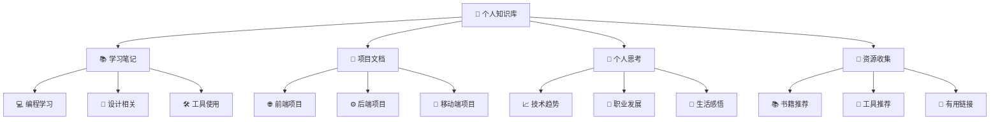

  

#### 你好 👋 程序员们

#### 我是一个梦想调色师

#### 热爱为开源贡献的技术专家

---

### 关于我

- 💡 &nbsp;&nbsp;我喜欢探索新技术，开发软件解决方案和快速原型
- 📖 &nbsp;&nbsp;我正在学习绘制 **SVG**
- 🎧 &nbsp;&nbsp;喜欢听 **音乐** 和看 **电影**
- 🐈‍ &nbsp;&nbsp;喜欢 **小狗** 和 **小猫**
- 🧑🏻‍💻 &nbsp;&nbsp;喜欢写 **代码**
  <!-- - ⛏ &nbsp;&nbsp;Recently addicted to **blockchain** and **digital cryptocurrency** -->
  <!-- 📝 &nbsp;&nbsp;See my [**Curriculum Vitae**](https://) to get more info.-->

 

### GitHub 统计

  
  

---

---

# 🧠 个人知识库

*构建智慧，分享成长*

---

## 🎨 知识图谱

---

## 🚀 快速导航

| 🎓 **学习笔记** | 💼 **项目文档** |
|:---:|:---:|
|  |  |
|  |  |
|  |  |

| 💭 **个人思考** | 📖 **资源收集** |
|:---:|:---:|
|  |  |
|  |  |
|  |  |

---

## ✨ 知识库特色

| 🎯 **核心功能** | 📊 **数据统计** |
|:---:|:---:|
|  |  |
|  |  |

---

## 🎪 知识库入口

